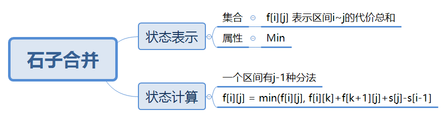

# 区间DP

## 基本问题
> [AcWing 282. 石子合并](https://www.acwing.com/problem/content/284/)

设有 N 堆石子排成一排，其编号为 1,2,3,…,N  
每堆石子有一定的质量，可以用一个整数来描述，现在要将这 N堆石子合并成为一堆。

每次只能合并相邻的两堆，合并的代价为这两堆石子的质量之和，合并后与这两堆石子相邻的石子将和新堆相邻，
合并时由于选择的顺序不同，合并的总代价也不相同。  

例如有 4堆石子分别为 1 3 5 2， 我们可以先合并 1、2堆，代价为 4，得到 4 5 2， 又合并 1、2堆，代价为 9，得到 9 2 ，
再合并得到 11，总代价为 4+9+11=24  
如果第二步是先合并 2、3堆，则代价为 7，得到 4 7，最后一次合并代价为 11,总代价为 4+7+11=22。

问题是：找出一种合理的方法，使总的代价最小，输出最小代价。

## 思路导图


## 算法代码
```
# include <bits/stdc++.h>

using namespace std;

const int N = 310;

int s[N], f[N][N];

int main(void){
    int n;
    cin>>n;
    
    for(int i=1;i<=n;i++) scanf("%d",&s[i]);
    
    for(int i=1;i<=n;i++) s[i] += s[i-1];
    
    for(int len=2;len<=n;len++){
        for(int i=1;i<=n-len+1;i++){ //i 是有范围的
            int l = i, r = i + len - 1;
            f[l][r] = 1e9; // 注意要初始化f[l][r]
            for(int k=l;k<r;k++){
                f[l][r] = min(f[l][r],f[l][k]+f[k+1][r]+s[r]-s[l-1]);
            }
        }
    }
    
    cout<<f[1][n]<<endl;
    return 0;
}
```

## 算法思路
* 在确定头尾的情况下，不管怎么合并的代价相同: `s = s[r] + s[l-1]`


