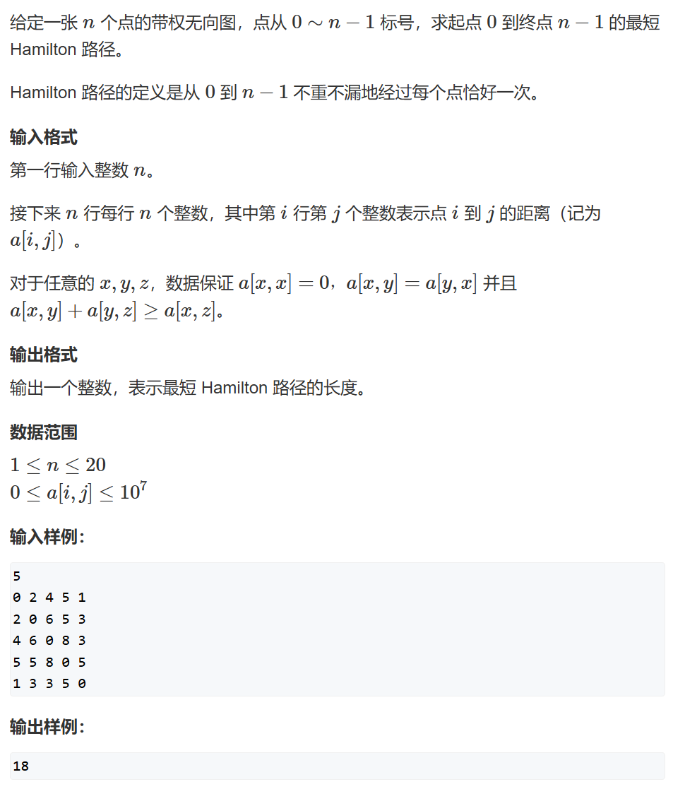

# 最短Hamilton路径
> [AcWing 91. 最短Hamilton路径](https://www.acwing.com/activity/content/problem/content/1011/)

## 题目描述


## 问题分析
1. **做法分析**：本题数据大小不大，N在31以下，同时题目方便用二进制表示，故本题使用 **状态压缩DP** 解决
2. **状态抽象**
   - 本题要求每个点都经历一遍，故用 *path* 维度表示每个点是否经历
   - 本题保证两两点之间有通路，故不用保证路径
   - 本题对终点有要求，需要用 *end* 维度表示当前路径的终点
3. **状态计算**
   - 用 `f[i][j]` 表示 `f[path][end]`
   - 状态依赖性：`f[i][j]` 依赖 `f[i-(1<<j)][k]` 
   - 起始状态：题目要求从`0`开始，`f[1][0]=0`，1表示只经过0点
   - 中间状态：`f[i][j] = min(f[i][j], f[i-{j}][k]+w[k][j]`:`i`路径`j`终点更新为到**倒数第二点**`k`的距离加`k`到`j`的距离`w[k][j]`
   - 最终状态：`answer = f[(1<<n)-1][n-1]` 表示经过所有点到终点的最短路径
4. **细节处理**
   - `f[][]`要用 $+\infty$ 初始化
   - 状态依赖`f[i-(1<<j)][k]`，要求了`i`必须从小到大遍历，故`i`,`j`的遍历顺序不能相反
   - 位运算优先级低于加减，位运算要括号
   - `f[][]`中的二进制维应用 `1<<N` 定义

## 思路导图


## 整体代码
```
#include <bits/stdc++.h>

using namespace std;

const int N = 21, M = 1<<N;

int w[N][N];
int f[M][N]; // 记得状态压缩维用M

int main(void){
    int n;
    cin>>n;
    memset(f,0x3f,sizeof f);
    f[1][0] = 0; // 记得预处理
    
    for(int i=0;i<n;i++)
        for(int j=0;j<n;j++)
            scanf("%d",&w[i][j]);
        
    for(int i=0;i<1<<n;i++){ //从0开始，所有方案0号位都为1
        for(int j=0;j<n;j++){
            if(i>>j&1){
                for(int k=0;k<n;k++){
                    if((i-(1<<j))>>k&1){
                        f[i][j] = min(f[i][j],f[i-(1<<j)][k]+w[k][j]);
                    }
                }
            }
        }
    }
    
    cout<<f[(1<<n)-1][n-1]<<endl;
    return 0;
}
```

## 细节分析
1. `for(int i=0;i<1<<n;i++)` 表示遍历路径
2. `for(int j=0;j<n;j++)   if(i>>j&1)` 表示找到`i`路径的所有可能终点
3. `for(int k=0;k<n;k++)   if((i-(1<<j))>>k&1)` 表示找到所有的‘倒数第二点’

## 算法优化
1. 将`for(int i=0;i<1<<n;i++)`优化为`for(int i=1;i<1<<n;i+=2)`，将`i`的第一位恒等于1，表示路径永远从0开始


