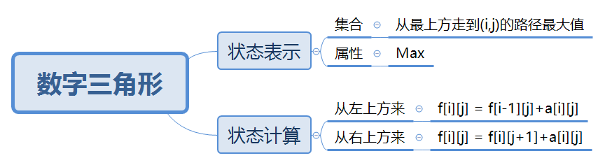

# 线性DP
线性DP可以定义为：在一个问题的求解过程中，问题的状态转移可以通过一个线性序列的顺序关系来完成，
每个状态仅依赖于前一（或前几）个状态的结果。 
这种问题通常可以通过一次遍历或者两次遍历来解决。

## 数字三角形
> [AcWing 898. 数字三角形](https://www.acwing.com/problem/content/900/)

### 题目大意
数字组成金字塔形状的三角形，从上到下每行有1，2，3……n个数字。
从顶部出发，在每一结点可以选择移动至其左下方的结点或移动至其右下方的结点，一直走到底层，
要求找出一条路径，使路径上的数字的和最大。

### 思路导图


### 整体代码
```
int main(void){
    int n;
    cin>>n;
    // memset(f,-0x3f,sizeof f); memset 初始化负数要用 0x9f

    memset(f,0x9f,sizeof f);

    for(int i=1;i<=n;i++){
        for(int j=1;j<=i;j++){
            scanf("%d",&a[i][j]);
        }
    }

    f[1][1] = a[1][1];
    for(int i=2;i<=n;i++){
        for(int j=1;j<=i;j++){
            f[i][j] = max(f[i-1][j-1]+a[i][j], f[i-1][j]+a[i][j]);
        }
    }

    int ans = -INF;
    for(int j=1;j<=n;j++) ans = max(ans,f[n][j]);

    cout<<ans<<endl;
    return 0;
}
```

* 要将数组初始化为负无穷，应用 `memset(f,0x9f,sizeof f);`
* 在二维线性DP中，要考虑边界情况，将边界合理的设置为0，负无穷

## 最长上升子序列
> [AcWing 895. 最长上升子序列](https://www.acwing.com/problem/content/897/)

### 题目大意
给定一个长度为 N 的数列，求数值严格单调递增的子序列的长度最长是多少。  
最长上升子序列：数值严格递增，下标严格递增的序列

### 思路导图


### 整体代码
```
int main(void){
    int n;
    cin>>n;

    for(int i=1;i<=n;i++){
        scanf("%d",&a[i]);
    }

    for(int i=1;i<=n;i++){
        f[i] = 1; // 每个fi都要更新为1：每个i都有可能是起点
        for(int j=1;j<i;j++){
            if(a[j]<a[i]){
                f[i] = max(f[i],f[j]+1);
            }
        }
    }

    int ans = -1e9;
    for(int i=1;i<=n;i++){
        ans = max(ans,f[i]);
    }

    cout<<ans<<endl;
    return 0;
}
```


