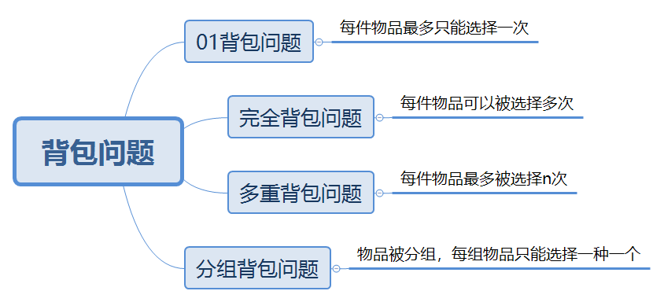
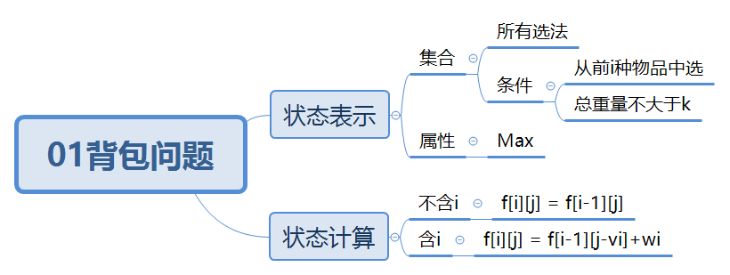
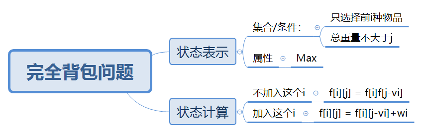
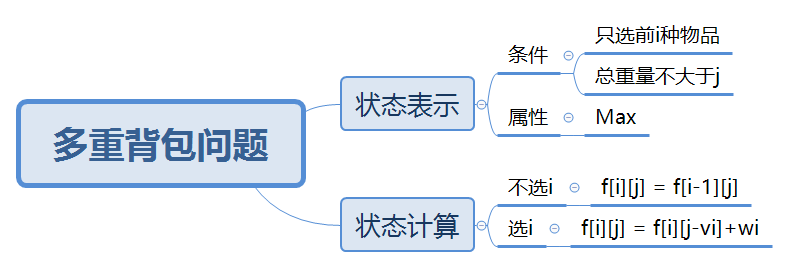
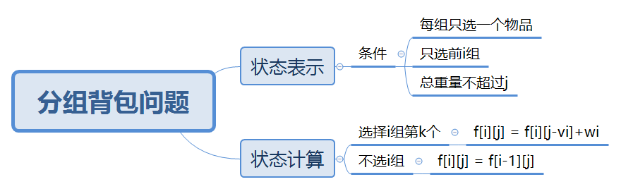

# 背包问题



## 01背包问题
> [AcWing 2. 01背包问题](https://www.acwing.com/activity/content/problem/content/997/)
### 基本问题
有 N件物品和一个容量是 V的背包。每件物品只能使用一次。  
第 i件物品的体积是 vi，价值是 wi  
求解将哪些物品装入背包，可使这些物品的总体积不超过背包容量，且总价值最大。输出最大价值。

**输入格式**  
第一行两个整数，N，V，用空格隔开，分别表示物品数量和背包容积。  
接下来有 N行，每行两个整数 vi,wi，用空格隔开，分别表示第 i 件物品的体积和价值  

**输出格式**  
输出一个整数，表示最大价值。  

**数据范围**  
$0<N,V\leq1000$  
$0<v_i,w_i\leq1000$  

**输入样例**
```
4 5
1 2
2 4
3 4
4 5
```

**输出样例** 
```
8
```
### 思路导图


### 问题特征
1. 限制物品种类数，限制最大容积
2. **每种物品最多选一次**
3. 问物品的最大价值

### 状态转移方程

$$
f[i][j] = max(f[i][j],f[i-1][j-v[i]]+w[i])
$$

令 $v_i$ 表示体积， $w_i$ 表示价值， $i$ 表示只用前 $i$ 种类， $j$ 表示容积  
`f(i,j)` 表示 **只选前 $i$ 种,体积最大为 $j$ 的最大价值选法**

$$
Dp = 
\begin{cases}
0 & j=0 \\\\
max(f_{i-1,j}|f_{i-1,j-vi}+wi) & j\neq 0
\end{cases}
$$

### 朴素做法
```
int main(void){
    int n, m;
    cin>>n>>m;

    for(int i=1;i<=n;i++){
        cin>>v[i]>>w[i];
    }

    for(int i=1;i<=n;i++){
        for(int j=1;j<=m;j++){
            f[i][j] = f[i-1][j];
            if(j>=v[i]) f[i][j] = max(f[i][j],f[i-1][j-v[i]]+w[i]);
        }
    }
    cout<<f[n][m]<<endl;
   
```
* 朴素做法中发现 `f_{ij}` 完全依赖于 `f_{i-1,j}`, 故考虑掉省去第一维变量

### 优化做法
```
int main(void){
    int n, m;
    cin>>n>>m;

    for(int i=1;i<=n;i++){
        cin>>v[i]>>w[i];
    }

    for(int i=1;i<=n;i++){
        for(int j=m;j>=v[i];j--){
            f[j] = max(f[j],f[j-v[i]]+w[i]);
        } //为什么这里要逆序？因为如果j顺序更新，j的值又基于小于j的j，导致
          //更新时用到已经更新过一遍的值
    }
    cout<<f[m]<<endl;
    return 0;
}
```
* 优化做法将 $j$ 逆序遍历，原因是循环中 $j$ 顺序更新，如果顺序遍历则会 **污染数据**

## 完全背包问题
> [AcWing 3. 完全背包问题](https://www.acwing.com/problem/content/3/)

### 基本问题
有 N种物品和一个容量是 V的背包，每种物品都有无限件可用。  
第 i种物品的体积是 vi，价值是 wi。  
求解将哪些物品装入背包，可使这些物品的总体积不超过背包容量，且总价值最大。  
输出最大价值。

**输入输出同上**

### 思路导图


### 问题特征
* 相对于01背包问题，一个物品可以被选择多次
* 这意味着状态转移方程由 **是否选i** 转变为了 **是否要再选一个i**
* 因为相对于01背包问题，品种不再重要，故不考虑由i的状态转移，而考虑j的状态转移

### 状态转移方程

$$
f[i][j] = max(f[i][j],f[i][j-v[i]]+w[i])
$$

$$
Dp = 
\begin{cases}
0 & j=0\\\\
max(f_{i-1,j}, f_{i,j-vi}+wi) & j\neq0
\end{cases}
$$

### 朴素做法
```
int main(void){
    int n, m;
    cin>>n>>m;
    
    for(int i=1;i<=n;i++){
        int vi, wi;
        scanf("%d%d",&vi,&wi);
        v[i] = vi; w[i] = wi;
    }
    
    for(int i=1;i<=n;i++){
        for(int j=0;j<=m;j++){
            f[i][j] = f[i-1][j];
            if(j>=v[i]);
        }
    }
    cout<<f[n][m]<<endl;
    return 0;
}
```
* 考虑到和01背包问题一样的结构，将其压缩到一维有：

### 优化做法
```
int main(void){
    int n, m;
    cin>>n>>m;
    
    for(int i=1;i<=n;i++){
        cin>>v[i]>>w[i];
    }
    
    for(int i=1;i<=n;i++){
        for(int j=v[i];j<=m;j++){
            f[j] = max(f[j],f[j-v[i]]+w[i]);
        }
    }
    cout<<f[m]<<endl;
    return 0;
}
```

### 完全背包与01背包之间的联系
* 可以观察到，01背包问题与完全背包问题的优化代码差别 **仅仅是j的遍历方向相反**
* 01背包问题：从大到小遍历j，以避免同一物品在同一阶段被重复选择。
* 完全背包问题：从小到大遍历j，以便每次都可以利用已更新的状态，允许多次选择同一物品。

## 多重背包问题
> [AcWing 4. 多重背包问题](https://www.acwing.com/problem/content/4/)

### 基本问题
有N种物品和一个容量是 V的背包。  
第 i种物品最多有 si件，每件体积是 vi，价值是 wi。  
求解将哪些物品装入背包，可使物品体积总和不超过背包容量，且价值总和最大。  
输出最大价值。

**输入格式**  
第一行两个整数，N，V，用空格隔开，分别表示物品种数和背包容积。  
接下来有 N行，每行三个整数 vi,wi,si，用空格隔开，分别表示第 i种物品的体积、价值和数量。

**输出格式**  
输出一个整数，表示最大价值。  

**数据范围**  
$0<N,V\leq100$  
$0<v_i,w_i,s_i\leq100$  

**输入样例**  
```
4 5
1 2 3
2 4 1
3 4 3
4 5 2
```

**输出样例**  
```
10
```

### 思路导图
  

### 问题特征
* 本题限制了一种物品的最大拿去个数
* 本题既不能用01背包问题，也不能用完全背包问题解决，因为临界条件下无法作状态转移
* 本题的思路是将原问题**转化为01背包问题**
* 用二进制优化，将最大限制为 $s$ 的种类优化为 $\log n$ 个种类，通过这些种类表示 $i$ 的个数

### 朴素做法
```
int main(void){
    int n, m;
    cin>>n>>m;
    
    for(int i=1;i<=n;i++){
        cin>>v[i]>>w[i]>>s[i];
    }
    
    for(int i=1;i<=n;i++){
        for(int j=0;j<=m;j++){
            for(int k=0;k<=s[i]&&k*v[i]<=j;k++){
                f[i][j] = max(f[i][j],f[i-1][j-k*v[i]]+k*w[i]);
            }
        }
    }
    cout<<f[n][m]<<endl;
    return 0;
}
```

### 二进制优化做法
```
int main(void){
    int n, m, cnt = 0;
    cin>>n>>m;

    for(int i=1;i<=n;i++){
        int vi, wi, si;
        cin>>vi>>wi>>si;
        int k = 1, r = si;

        while(k<=r){
            cnt++;
            v[cnt] = vi * k;
            w[cnt] = wi * k;
            r -= k;
            k *= 2;//顺序
        }
        if(r>0){
            cnt++;//注意cnt是大循环变量
            v[cnt] = vi * r;
            w[cnt] = wi * r;
        }
    }

    for(int i=0;i<=cnt;i++){
        for(int j=m;j>=v[i];j--){
            f[j] = max(f[j], f[j-v[i]]+w[i]);
        }
    }

    cout<<f[m]<<endl;
    return 0;
}
```
* 将时间复杂度由 $O(n^3)$ 优化为了 $O(n^2 \log n)$ 

## 分组背包问题
>[分组背包问题](https://www.acwing.com/problem/content/9/)

### 基本问题
有 N组物品和一个容量是 V的背包。  
每组物品有若干个，同一组内的物品最多只能选一个。每件物品的体积是 vij，价值是 wij，其中 i是组号，j是组内编号。 
求解将哪些物品装入背包，可使物品总体积不超过背包容量，且总价值最大。  
输出最大价值。  

### 思路导图


### 状态转移方程

$$
f[j] = max(f[j],f[j-v[i][k]]+w[i][k])
$$

### 朴素做法
```
int main(void){
    int n, m;
    cin>>n>>m;
    
    for(int i=1;i<=n;i++){
        cin>>s[i];
        for(int j=0;j<s[i];j++){
            cin>>v[i][j]>>w[i][j];
        }
    }
    
    for(int i=1;i<=n;i++){
        for(int j=m;j>=0;j--){
            for(int k=0;k<s[i];k++){
                if(j>=v[i][k]) f[j] = max(f[j],f[j-v[i][k]]+w[i][k]);
            }
        }
    }
    
    cout<<f[m]<<endl;
    return 0;
}
```


