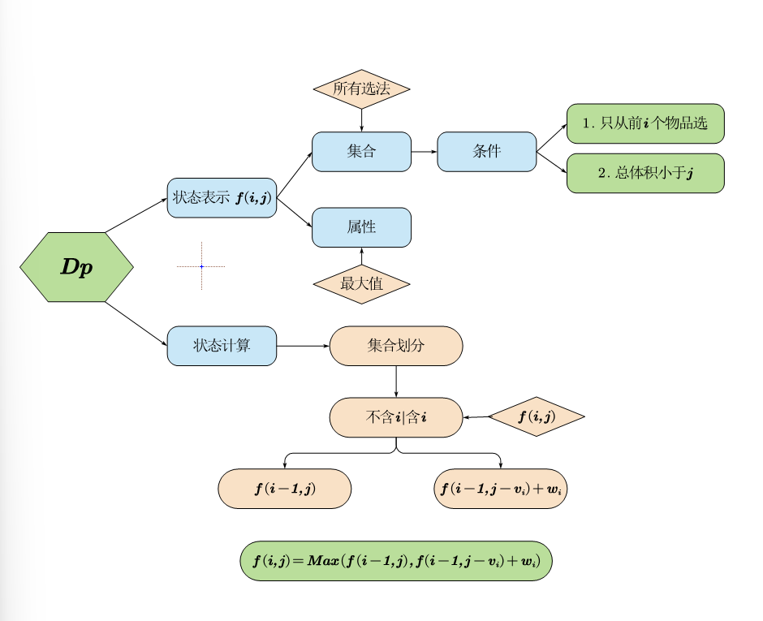

# 背包问题



## 01背包问题

### 基本问题
有 N件物品和一个容量是 V的背包。每件物品只能使用一次。  
第 i件物品的体积是 vi，价值是 wi  
求解将哪些物品装入背包，可使这些物品的总体积不超过背包容量，且总价值最大。输出最大价值。

**输入格式**  
第一行两个整数，N，V，用空格隔开，分别表示物品数量和背包容积。  
接下来有 N行，每行两个整数 vi,wi，用空格隔开，分别表示第 i 件物品的体积和价值  

**输出格式**  
输出一个整数，表示最大价值。  

**数据范围**  
$0<N,V\leq1000$  
$0<v_i,w_i\leq1000$  

**输入样例**
```
4 5
1 2
2 4
3 4
4 5
```

**输出样例** 
```
8
```

### 问题特征
1. 限制物品种类数，限制最大容积
2. **每种物品最多选一次**
3. 问物品的最大价值

### 动态规划表达式

令 $v_i$ 表示体积， $w_i$ 表示价值， $i$ 表示只用前 $i$ 种类， $j$ 表示容积  
$f(i,j)$ 表示 **只选前 $i$ 种,体积最大为 $j$ 的最大价值选法**

$$
Dp = 
\begin{cases}
0 & j=0 \\\\
max(f_{i-1,j}|f_{i-1,j-vi}+wi) & j\neq 0
\end{cases}
$$


