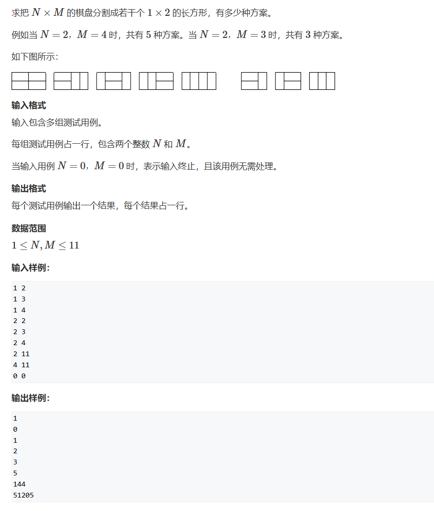
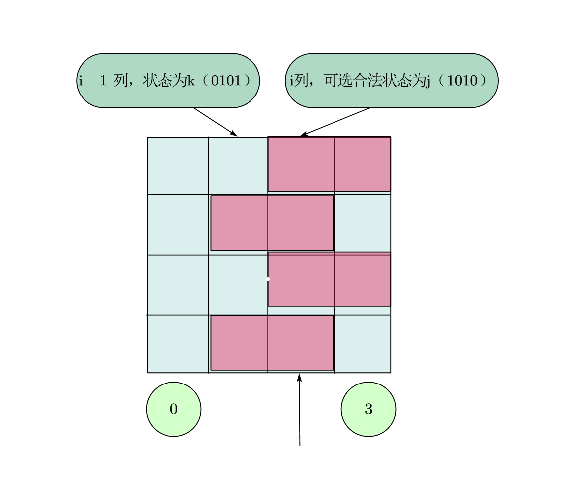

# 蒙德里安的梦想
> [AcWing 291. 蒙德里安的梦想](https://www.acwing.com/activity/content/problem/content/1010/)  
蒙德里安的梦想这道题是一道经典的状态压缩DP

## 题目描述
  

## 题目思路
### 为什么是状态压缩DP
* 状态压缩DP的特点：**因为状态表示的复杂，需要将高维状态压缩为地位状态**
* 本题的**图形大小不大，可以用二进制表示**
* 本题基于格子表示，可以很好的用二进制数组保存

### 状态表示
* 摆放完所有的横矩形后，剩下的竖矩形只有一种或者零种摆法，故 **只用考虑横矩形的摆法**
* 每一列的格子来源：
  - 上一列摆完横矩形露出的
  - 这一列要拜访的横矩形
* 本列合法摆放横矩形的状态 _j_ 取决于
  - 上一列的横矩形状态 _k_
  - 是否可以合法的在剩余位置摆下竖矩形
 


### 状态计算
* `f[i][j]` 记录`i`列`j`摆法的 **总共合法方案数**
* 初始化 `f[0][0]=1` 表示第0列的0状态只有一种摆法
* `f[i-1][k]` 表示对于i列j状态**合法**的`i-1`列`k`状态的 **总共合法方案数**
* 当前列的方案数由 **所有当前列的合法上一列摆法之和** 组成，即 `f[i][j] += f[i-1][k]`

## 思路导图


## 整体代码
```
# include <bits/stdc++.h>

using namespace std;

const int N = 12, M = 1<<12;

bool st[M];
vector<int> state[M];
long long f[N][M];

void init(int n){
    for(int i=0;i<1<<n;i++){
        int cnt = 0;
        bool is_valid = true;
        for(int j=0;j<n;j++){
            if(i>>j&1){ //不能合并？
                if(cnt&1){
                    is_valid = false;
                    break;
                }
            }
            else cnt++;
        }
        if(cnt&1) is_valid = false;
        st[i] = is_valid;
    }

    for(int i=0;i<1<<n;i++){
        state[i].clear();
        for(int j=0;j<1<<n;j++){
            if(((i&j)==0) && (st[i|j])){
                state[i].push_back(j);
            }
        }
    }
    return;
}

int main(void){
    int n, m;

    while(cin>>n>>m,n||m){
        init(n);
        memset(f,0,sizeof f);
        f[0][0] = 1;
        for(int i=1;i<=m;i++){
            for(int j=0;j<1<<n;j++){
                for(auto k : state[j]){
                    f[i][j] += f[i-1][k];
                }
            }
        }
        cout<<f[m][0]<<endl;
    }
    return 0;
}
```

## 代码细节
### 1. 变量解释
```
bool st[M]; //对于一列，判断是否合法（空缺可以被竖矩形填满）
vector<int> state[M]; //对于`i`列，所有合法的左列状态
long long f[N][M]; // Dp对象，从0开始，保存总个数
```

### 2. 预处理-合法性
对单独的一列判断合法性：如果出现**连续奇数未填满**，判定为不合法
```
    for(int i=0;i<1<<n;i++){
        int cnt = 0;
        bool is_valid = true;
        for(int j=0;j<n;j++){
            if(i>>j&1){ //不能合并？
                if(cnt&1){
                    is_valid = false;
                    break;
                }
            }
            else cnt++;
        }
        if(cnt&1) is_valid = false;
        st[i] = is_valid;
    }
```
1. `if(i>>j&1)` 判定该位是否为1（填充）
2. `if(cnt&1)` 判定未填充部分是否为奇数，奇数情况下竖矩形无法填满，不合法
3. 将一种状态是否合法保存在`st`中

### 3. 预处理-合法的左列
对于一列，要找到所有合法的左列
```
    for(int i=0;i<1<<n;i++){
        state[i].clear(); //有多组样例，必须清理
        for(int j=0;j<1<<n;j++){
            if(((i&j)==0) && (st[i|j])){
                state[i].push_back(j);
            }
        }
    }
```
1. `if(((i&j)==0) && (st[i|j]))`: 本列与左列不重合，并且剩下的空缺合法
2. `state[i].push_back(j)`：j是i的合法左列,`state[i]`中有所有的合法左列

### 4. 动态规划主循环
```
    while(cin>>n>>m,n||m){
        init(n);
        memset(f,0,sizeof f);
        f[0][0] = 1;
        for(int i=1;i<=m;i++){
            for(int j=0;j<1<<n;j++){
                for(auto k : state[j]){
                    f[i][j] += f[i-1][k];
                }
            }
        }
        cout<<f[m][0]<<endl;
    }
```
1. `f[0][0] = 1`第0列无需处理，因为它显然没有合法左列
2. `for(int i=1;i<=m;i++)` 遍历从1开始的列，第`m`列是不存在的，目的是找到所有合法的最后一列
3. `for(int j=0;j<1<<n;j++)` 遍历第`i`列的所有合法可能
4. `for(auto k : state[j])` 找到`i`的合法左列
5. `f[i][j] += f[i-1][k]` 收集所有可能性


