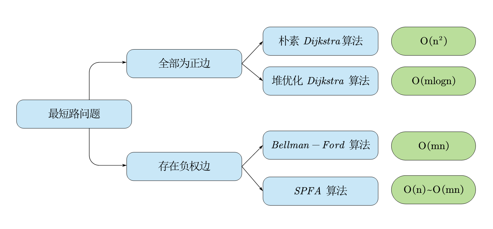

# 存在负权的有向图
> Tags:  最短路  负权边  判断负环  
> [AcWing 851. spfa求最短路](https://www.acwing.com/activity/content/problem/content/920/)  
> [AcWing 852. spfa判断负环](https://www.acwing.com/activity/content/problem/content/921/)  
> [AcWing 853. 有边数限制的最短路](https://www.acwing.com/activity/content/problem/content/922/)  

## 算法总结



#### 正权图求最短路
* 一般情况下可以用 ***SPFA* 算法** 解决
* 如果卡复杂度在 $O(mlogn)-O(mn)$ 之间（常出现于表格图），则使用 **堆优化 *Dijkstra* 算法**

#### 负权图求最短路
* 一般情况下可以用 ***SPFA* 算法** 解决
* 如果限定**最多经过的边**，使用 ***Bellman-Ford* 算法** 解决

#### 判断是否有负环
* 一般情况下可以用 ***SPFA* 算法** 解决

## *SPFA* 算法求最短路
### 整体代码
```
int spfa(){
    queue<int> q;
    memset(dist,0x3f,sizeof dist);
    dist[1] = 0;
    q.push(1);
    st[1] = true;

    while(q.size()){
        int t = q.front();
        q.pop();
        st[t] = false;

        for(int i=h[t];i!=-1;i=ne[i]){
            int j = e[i];
            if(dist[j]>dist[t]+w[i]){
                dist[j]=dist[t]+w[i];
                if(!st[j]) {
                    q.push(j);
                    st[j] = true;
                }
            }
        }
    }

    return dist[n];
}
```

### 算法思想
1. 创建队列q,存放**在比较中变小的边**，st中存放标记判断点**是否在队列中**
2. 每次取队头元素，更新与之相邻的边，如果边变小则入队
3. *SPFA* 算法是 *B-F* 算法的优化
4. st 数组起优化作用：如果点在队中，不入队

## *SPFA* 算法判断是否存在负环
### 整体代码
```
bool spfa(){
    queue<int> q;

    for(int i=1;i<=n;i++){
        st[i] = true;
        q.push(i);
    }

    while(q.size()){
        int t = q.front();
        q.pop();
        st[t] = false;

        for(int i=h[t];i!=-1;i=ne[i]){
            int j = e[i];
            if(dist[j]>dist[t]+w[i]){
                dist[j]=dist[t]+w[i];
                cnt[j]=cnt[t]+1;
                if(cnt[j]>n) return true;
                if(!st[j]) {
                    q.push(j);
                    st[j] = true;
                }
            }
        }
    }

    return false;
}

```

### 算法思想
* 添加 cnt 数组，记录点入队的次数，如果入队次数大于n说明存在负环（抽屉原理）

## *Bellman-Ford* 算法
```
int bellman_fold(){
    memset(dist,0x3f,sizeof dist);
    dist[1] = 0;

    for(int i=0;i<k;i++){
        memcpy(backup, dist, sizeof dist);
        for(int j=0;j<m;j++){
            int a=Edges[j].a, b=Edges[j].b, w=Edges[j].w;
            dist[b] = min(dist[b], backup[a]+w);
        }
    }

    if(dist[n]>0x3f3f3f3f/2) return 0x3f3f3f3f;
    return dist[n];
}

```
* k限制了最多经过的边
* 因为 *B-F* 算法没有拓扑序（SPFA有），所以要用if(dist[n]>0x3f3f3f3f/2)判断


