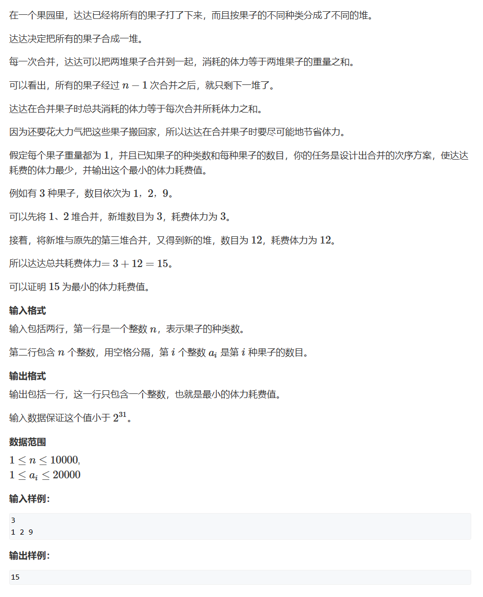

# Huffman树
哈夫曼树（Huffman Tree），又称最优二叉树，是一种用于数据压缩的树形结构。它是一种带权路径最短的二叉树，常用于文件压缩等领域。由美国计算机科学家大卫·哈夫曼（David Huffman）在1952年提出。  
在最初学习数据结构时，哈夫曼树被用在电报编码中：为了尽可能节省电报的位数建立哈夫曼树。  
哈夫曼树的普遍用法是**树的带权路径长度最小**

## 合并果子
> [AcWing 148. 合并果子](https://www.acwing.com/problem/content/150/)  


### 思路
1. 不同于DP中的合并石子，本题可以合并任何果子堆而不是局限于相邻。
2. 介于贪心的思想，需要求**树的最短带权路径
3. 以果子堆为叶，建立**Huffman树**

### 整体代码
```
int main(void){
    priority_queue<int, vector<int>, greater<int>> heap;
    
    int n;
    cin>>n;
    while(n--) {
        int x;
        scanf("%d",&x);
        heap.push(x);
    }
    
    int res = 0;
    while(heap.size()>1){
        int a = heap.top(); heap.pop();
        int b = heap.top(); heap.pop();
        res += (a+b);
        heap.push(a+b);
    }
    
    cout<<res<<endl;
    return 0;
    
}
```

### 局部代码
1. 
```
  priority_queue<int, vector<int>, greater<int>> heap;
```
* 建立小根堆，将`top`设置为**最小的果子堆**

3. 
```
    while(heap.size()>1){
        int a = heap.top(); heap.pop();
        int b = heap.top(); heap.pop();
        res += (a+b);
        heap.push(a+b);
    }
```
* 用优先队列维护最小的叶子节点


