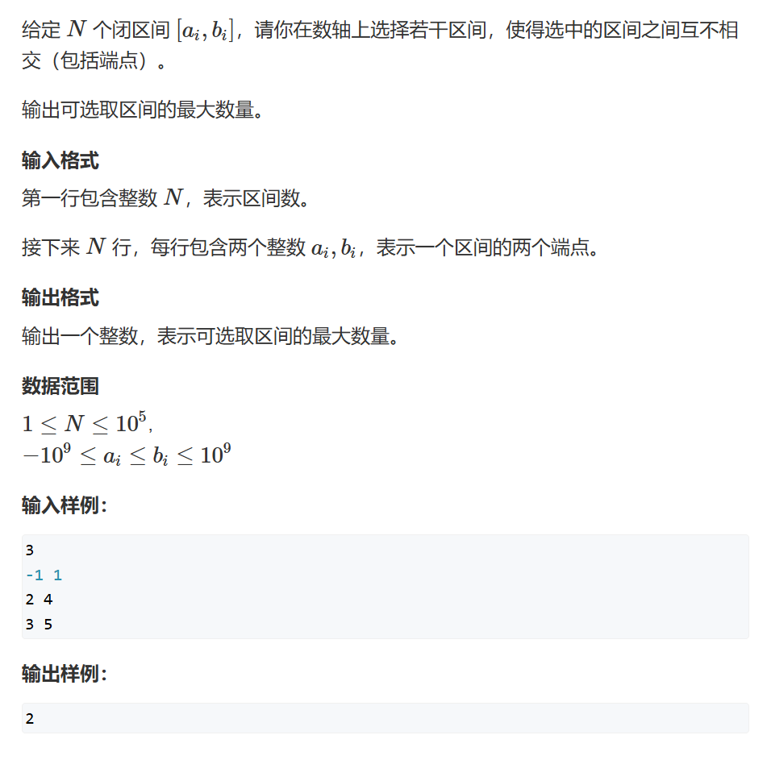
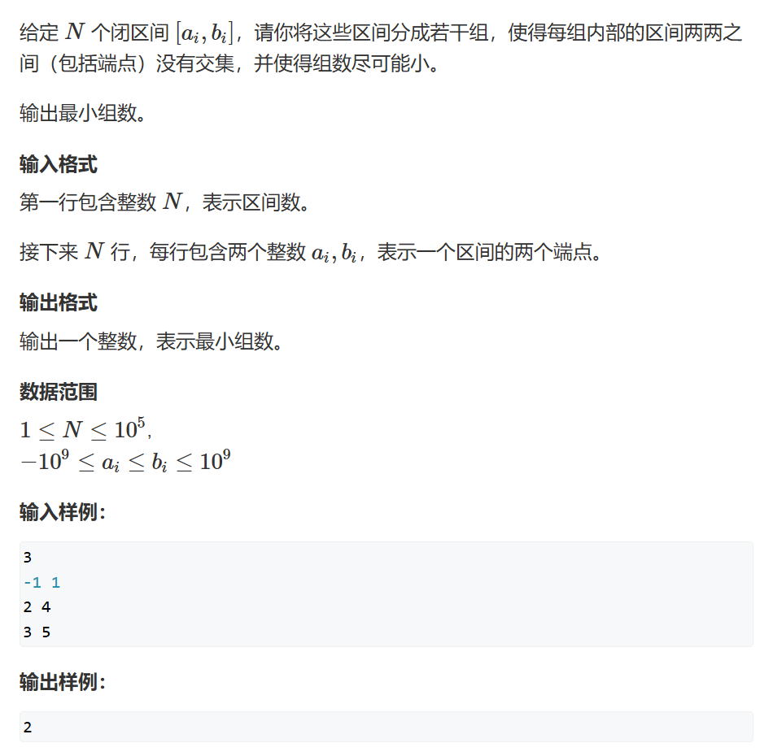

# 区间问题

贪心算法在解决区间问题时，通常基于一个核心思想：每次选择局部最优的方案，期望通过多次选择最终得到全局最优解。在各种与区间相关的问题中，贪心算法广泛应用，特别是在涉及区间的覆盖、选择和调度等问题中。

## 一、区间选点
> [AcWing 905. 区间选点](https://www.acwing.com/problem/content/907/)


### 思路
1. 将所有区间按**右端点**从小到大排序
2. 按顺序遍历每个区间，直到找到与第一个区间**错开**的区间，用该区间更新右端点，以上区间均可以被一个点串起来
3. 重复以上步骤，直到串起所有区间

### 整体代码
```
# include <bits/stdc++.h>

using namespace std;

const int N = 1e5+10;

struct Range{
    int l, r;
    bool operator< (const Range &w)const{
        return r<w.r;
    }
}range[N];

int main(void){
    int n;
    cin>>n;
    
    for(int i=0;i<n;i++){
        scanf("%d%d",&range[i].l,&range[i].r);
    }
    sort(range, range+n);
    
    int res = 0, ed = -2e9;
    
    for(int i=0;i<n;i++){
        if(range[i].l>ed){
            res++;
            ed = range[i].r;
        }
    }
    
    cout<<res<<endl;
    return 0;
}
```

### 局部代码
#### 1. 设计Range结构
```
struct Range{
    int l, r;
    bool operator< (const Range &w)const{
        return r<w.r;
    }
}range[N];
```
* `Range`结构包含左右端点`l`,`r`
* 还需要重载`<`运算符;在`sort`排序中按右端点顺序排序

### 2. 主循环
```
    for(int i=0;i<n;i++){
        if(range[i].l>ed){
            res++;
            ed = range[i].r;
        }
    }
```
* `if(range[i].l>ed)`找到完全错开的下一个区间
* `ed = range[i].r;`更新右端点

## 二、最大不相交区间数量
> [AcWing 908. 最大不相交区间数量](https://www.acwing.com/problem/content/910/)



### 思路
1. 与区间选点类似，同样是找不相交区间
2. 二者整体代码完全相同

## 三、区间分组

> [AcWing 906. 区间分组](https://www.acwing.com/problem/content/908/)



### 思路
1. 按左端点将所有区间排序
2. 用**右端点**代表大区间
3. 用**优先队列**维护一个最小的大区间
4. 由于区间是按左端点排序的，只要区间与**堆顶**有重合，则代表**与所有大区间有重合**；反之则**加入堆顶的大区间**
5. 堆中大区间的个数就是答案

### 整体代码
```
# include <bits/stdc++.h>

using namespace std;

const int N = 1e5+10;

struct Range{
    int l, r;
    bool operator<(const Range &w)const{
        return l<w.l;
    }
} range[N];


int main(void){
    int n;
    cin >> n;
    
    for(int i = 0; i < n; i++) {
        scanf("%d%d", &range[i].l, &range[i].r);
    }
    
    sort(range, range + n);
    
    priority_queue<int, vector<int>, greater<int>> pq; //大头堆
    
    for (int i = 0; i < n; i++) {
        if (!pq.empty() && pq.top() < range[i].l) {
            pq.pop();
        }
        pq.push(range[i].r);
    }
    
    
    cout << pq.size() << endl;
    return 0;
}

```

### 局部代码

#### 1. 区间合并的堆优化
```
    for (int i = 0; i < n; i++) {
        if (!pq.empty() && pq.top() < range[i].l) {
            pq.pop();
        }
        pq.push(range[i].r);
    }
```
* 初始状态堆为空，直接`push`
* 当区间可以合并到堆顶大区间时，即`pq.top() < range[i].l`，取出堆顶大区间并用该区间的右端点替代
* 当区间不能合并到堆顶大区间时，`pq.push(range[i].r);`,新开大区间

#### 2. 小头堆
`priority_queue<int, vector<int>, greater<int>> pq;`的堆是小偷堆，堆顶元素最小
